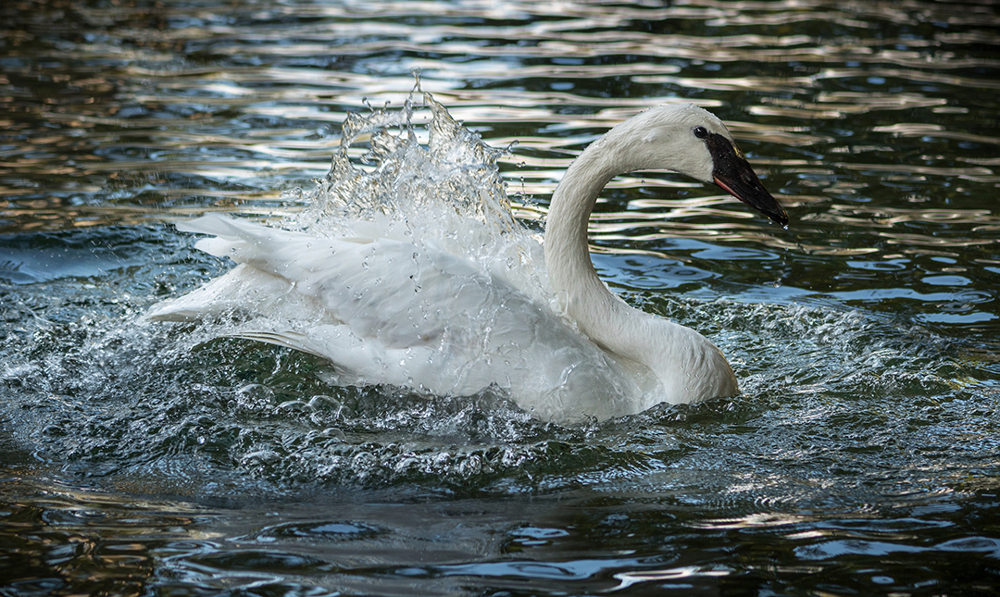

# 🦁 Zoo Chișinău - Pagina Web Informativă

## 📖 Descriere

Acest proiect reprezintă o pagină web pentru **Zoo Chișinău**, prezentând informații despre animale, program de vizitare și contacte. Scopul proiectului este de a demonstra crearea unei pagini web moderne cu layout flexibil, card-uri interactive și elemente de navigare.

Pagina oferă o experiență de utilizator plăcută prin design atractiv, imagini de animale și informații educative.

---

## 🎯 Obiectivele Proiectului

- ✅ Crearea unei structuri HTML semantică și bine organizată
- ✅ Design modern și responsiv
- ✅ Card-uri interactive cu imagini și descrieri
- ✅ Navigație funcțională
- ✅ Tabel pentru program de vizitare
- ✅ Buton fix pentru contact
- ✅ Integrare cu rețele sociale (Facebook)
- ✅ Utilizarea Google Fonts și Font Awesome

---

## 🧩 Funcționalități

### 📚 Conținut Principal

Pagina conține:
- **Header** cu titlu și moto a Zoo-ului
- **Navigare** cu link-uri (Acasă, Animale, Bilete, Contactează-ne)
- **6 card-uri cu animale** - Lebădă, Girafa, Jaguarul, Pitonul, Șarpele Rege, Tigrul
- **Program de vizitare** - Tabel cu ore de funcționare
- **Buton de contact** - Call button fix în colțul pagini
- **Footer** - Informații și link social media (Facebook)

---

### 🦁 Animalele Prezentate

| Animal | Descriere |
|--------|-----------|
| **Lebădă** | Cea mai mare păsoare acvatică din America de Nord |
| **Girafa** | Ajunge până la 18 metri, mănâncă frunze de copaci |
| **Jaguarul** | Cea mai mare pisică din America |
| **Pitonul** | Șarpe arboricol cu adaptări speciale |
| **Șarpele Rege** | Șarpe care vânează alte șerpi |
| **Tigrul** | Prădător cu vedere nocturna excepțională |

---

## 🛠️ Tehnologii Utilizate

| Tehnologie | Utilizare |
|-----------|-----------|
| **HTML5** | Structura semantică a pagini |
| **CSS3** | Stilizare și layout |
| **Flexbox** | Aranjare responsive a elementelor |
| **Google Fonts** | Font Montserrat pentru tipografie |
| **Font Awesome** | Pictograme pentru rețele sociale |

---

## 🎨 Paleta de Culori

| Culoare | Cod | Utilizare |
|---------|-----|-----------|
| **Blanchedalmond** | #FFEBCD | Header/Footer fundal |
| **Burlywood** | #DEB887 | Navigație fundal |
| **Wheat** | #F5DEB3 | Hover efect navigație |
| **RGB(255,241,221)** | #FFF1DD | Main fundal |
| **White** | #FFFFFF | Card-uri fundal |
| **Dark Gray** | #333333 | Text culoare principală |

---

## 📐 Structura HTML

```html
<body>
    <!-- HEADER -->
    <header>
        <h1>Bun venit la Zoo</h1>
        <p>Vă invităm să vedeți peste 1100 de animale...</p>
    </header>

    <!-- NAVIGAȚIE -->
    <nav>
        <ul>
            <li><a href="#">Acasă</a></li>
            <li><a href="#">Animale</a></li>
            <li><a href="#">Bilete</a></li>
            <li><a href="#">Contactează-ne</a></li>
        </ul>
    </nav>

    <!-- CONȚINUT PRINCIPAL -->
    <main>
        <section>
            <!-- CARD-URI ANIMALE -->
            <div class="animal-card">
                
                <div class="animal-info">
                    <h2>Lebăda</h2>
                    <p>Cea mai mare păsare acvatică...</p>
                </div>
            </div>
            <!-- ... alte card-uri ... -->
        </section>

        <!-- PROGRAM -->
        <section class="schedule">
            <h1>Programul Nostru</h1>
            <table>
                <tr>
                    <td>Luni</td>
                    <td>Închis</td>
                </tr>
                <tr>
                    <td>Marți-Duminică</td>
                    <td>09:00 - 18:00</td>
                </tr>
            </table>
        </section>
    </main>

    <!-- BUTON FIX CONTACT -->
    <button class="fixedbutton">
        <a href="tel:+37322763733">Contactează-ne</a>
    </button>

    <!-- FOOTER -->
    <footer>
        <div class="row">
            <div class="column">
                Te așteptăm la Gradina Zoologică...
            </div>
            <div class="column">
                <a href="..." class="fa fa-facebook"></a>
            </div>
        </div>
    </footer>
</body>
```

---

## 🎨 Elemente CSS Principale

### Card-uri Animale

```css
.animal-card {
    display: flex;           /* Layout orizontal */
    align-items: center;     /* Aliniere verticală */
    gap: 30px;              /* Spațiu între imagine și text */
    background: white;      /* Fundal alb */
    border-radius: 16px;    /* Colțuri rotunjite */
    margin: 20px auto;      /* Centrat pe pagină */
    transition: transform 0.2s ease, 
                box-shadow 0.5s ease;  /* Animații smooth */
}

.animal-card:hover {
    transform: translateY(-4px);  /* Efect lift pe hover */
    box-shadow: 0 8px 30px rgba(0, 0, 0, 0.15);
}

.animal-card img {
    width: 340px;
    height: 260px;
    object-fit: cover;  /* Pastrează aspect ratio */
    flex-shrink: 0;
}
```

### Navigație

```css
nav ul {
    list-style-type: none;  /* Elimină punctele */
    background-color: burlywood;
    overflow: hidden;       /* Clearfix pentru floats */
}

ul li {
    float: left;  /* Aranjare orizontală */
}

ul li a:hover {
    background-color: wheat;  /* Efect hover */
}
```

### Buton Fix Contact

```css
.fixedbutton {
    position: fixed;      /* Rămâne pe ecran */
    bottom: 10px;        /* Jos */
    right: 10px;         /* Dreapta */
    background-color: burlywood;
    padding: 10px 20px;
    border-radius: 10px;
    cursor: pointer;
}
```

### Tabel Program

```css
.schedule {
    background: white;
    border-radius: 16px;
    box-shadow: 0 4px 20px rgba(0, 0, 0, 0.1);
    padding: 30px;
    max-width: 500px;
}

.schedule table {
    width: 100%;
    border-collapse: collapse;
}

.schedule td {
    padding: 14px 20px;
    text-align: left;
}

.schedule td:last-child {
    text-align: right;
    font-weight: 600;
}
```

---

## 🚀 Cum se Folosește

1. **Deschidere în browser:** Double-click pe fișierul HTML
2. **Vizualizare:** Observă design-ul și card-urile interactive
3. **Navigație:** Clic pe link-uri din meniu
4. **Contact:** Clic pe butonul fix "Contactează-ne" pentru apel
5. **Rețele sociale:** Clic pe icoană Facebook pentru vizita pagini
6. **Inspectare:** Right-click → "Inspect" (F12) pentru a vedea CSS

---

## 💡 Concepte CSS Demonstrate

### Flexbox Layout

```css
.animal-card {
    display: flex;        /* Activează flexbox */
    gap: 30px;           /* Spațiu între elemente */
    align-items: center; /* Aliniere verticală */
}

.row {
    display: flex;
    justify-content: space-around;  /* Distribuție egală */
    align-items: center;
}
```

---

### Efecte Transition/Transform

```css
.animal-card {
    transition: transform 0.2s ease, 
                box-shadow 0.5s ease;
}

.animal-card:hover {
    transform: translateY(-4px);  /* Mișcare sus */
    box-shadow: 0 8px 30px rgba(0, 0, 0, 0.15);
}
```

---

### Pozitionare Fixed

```css
.fixedbutton {
    position: fixed;
    bottom: 10px;
    right: 10px;
}
```

---

## ✨ Caracteristici Implementate

- 🎨 Design modern cu paletă de culori caldi
- 📱 Layout responsiv (desktop-first)
- 🦁 Card-uri interactive cu imagini
- 🔄 Efecte hover pe elemente
- 📞 Buton de contact fix
- 🔗 Integrase cu rețele sociale
- 🎯 Navigație ușoară
- 📊 Tabel pentru program
- 🎭 Animații smooth cu CSS transitions

---

## 📚 Imagini Utilizate

Proiectul necesită imagini în folder `images/`:
- `swan.png` - Lebădă (500x400px)
- `giraffe.png` - Girafa (500x400px)
- `jaguar.png` - Jaguarul (500x400px)
- `python.png` - Pitonul (500x400px)
- `kingsnake.png` - Șarpele Rege (500x400px)
- `tiger.png` - Tigrul (500x400px)

---

## 📐 Proprietăți CSS Utilizate

| Proprietate | Utilizare | Exemplu |
|------------|-----------|---------|
| `display: flex` | Layout flexibil | Card-uri și navigație |
| `gap` | Spațiu între elemente flex | 30px |
| `border-radius` | Colțuri rotunjite | 16px |
| `box-shadow` | Umbră element | 0 4px 20px |
| `transition` | Animație smooth | 0.2s ease |
| `transform` | Transformare 2D | translateY(-4px) |
| `position: fixed` | Poziție fixed pe ecran | Buton contact |
| `object-fit: cover` | Aspect ratio imagine | Pastrează proporțiile |

---

## 🎓 Obiective de Învățare

Prin completarea acestui proiect, se demonstrează:

1. ✅ Structura HTML semantică pentru pagină complexă
2. ✅ Utilizarea Flexbox pentru layout modern
3. ✅ Designul card-urilor interactive
4. ✅ Efecte CSS cu hover și transitions
5. ✅ Navigație și structură site-ului
6. ✅ Integrare cu Google Fonts și Font Awesome
7. ✅ Tabel HTML pentru prezentare date
8. ✅ Buton de contact fix (UX improvement)
9. ✅ Rețele sociale integrare
10. ✅ Design responsiv pe mobile

---

## 🔧 Elemente Utilizate/Personalizate

- **Flexbox layout** pentru card-uri și navigație
- **Google Fonts** - Font Montserrat personalizat
- **Font Awesome** - Pictograme sociale
- **Animații CSS** - Transform și transition efecte
- **Paletă de culori** - Tonuri calde și plăcute
- **Card-uri interactive** - Cu efecte hover
- **Buton fixed** - Pentru contact ușor
- **Tabel structurat** - Pentru program vizitare
- **Shadow și border-radius** - Efecte moderne

---

## 💻 Browser Compatibility

- ✅ Chrome/Chromium
- ✅ Firefox
- ✅ Safari
- ✅ Edge
- ✅ Mobile browsers (iOS Safari, Chrome Mobile)

---

## 📝 Note Importante

- Imaginile sunt în folder `images/` - asigură-te că calea este corectă
- CSS este în fișier separat `style.css`
- Google Fonts se încarcă din CDN (necesită internet)
- Font Awesome se încarcă din CDN (necesită internet)
- Butonul contact folosește `tel:` protocol pentru apel direct
- Link Facebook se deschide în tab nou cu `target="_blank"`

---

## 🎯 Cum se Testează

1. **Desktop:** Deschide pagina pe calculator - observă card-urile și efectele
2. **Hover:** Pasează mouse-ul peste card-uri - observe efectul lift
3. **Navigație:** Clic pe link-uri din meniu
4. **Contact:** Clic pe butonul fix (pe telefon, va iniția apel)
5. **DevTools:** F12 pentru a inspecta HTML/CSS
6. **Responsive:** Redimensionează fereastra sau testează pe telefon

---

## 📊 Statistici Proiect

- **Linii HTML:** ~100
- **Linii CSS:** ~350+
- **Card-uri animale:** 6
- **Secțiuni principale:** 4 (Header, Navigație, Card-uri + Program, Footer)
- **Efecte hover:** 3 (navigație, card-uri, social icon)
- **Google Fonts:** 1 (Montserrat)
- **Font Awesome iocoane:** 1 (Facebook)

---

## 🏆 Criterii de Evaluare

- ✅ HTML semantic și bine structurat
- ✅ Design modern și atractiv
- ✅ Card-uri interactive cu imagini
- ✅ Navigație funcțională
- ✅ CSS Flexbox folosit corect
- ✅ Animații și efecte hover
- ✅ Program vizitare în tabel
- ✅ Buton de contact funcțional
- ✅ Rețele sociale integrate
- ✅ Paletă de culori coerență

---

## 🌐 Funcționalități Avansate

- **Tel Protocol:** `<a href="tel:+37322763733">` - Apel direct pe mobile
- **Social Media:** Font Awesome cu link Facebook
- **Box Shadow:** Efecte de adâncime pe card-uri
- **Transform:** `translateY(-4px)` - Mișcare animată
- **Transition:** Animații smooth la hover
- **Fixed Positioning:** Buton care rămâne vizibil

---

## 📞 Autor

**Carchilan Marius**  
Anul 3 - CEITI Technical College  
Web Development Course

---

**Status:** ✅ Complet  
**Dificultate:** Intermediar  
**Timp estimat:** 2-3 ore  
**Cuvinte cheie:** Zoo, Flexbox, Card-uri Interactive, CSS Transitions, Responsive Design, Modern Web