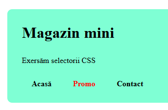
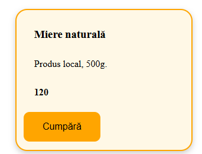

RAPORT – SELECTORI CSS
Lucrare practică: Selectorii în CSS

------------------------------------------------------------
FOAIE DE TITLU
------------------------------------------------------------

Denumirea lucrării: Selectorii în CSS – Magazin Mini  
Nume și prenume: Carchilan Marius
Grupa: P-2331
Data: 24.02.2026

------------------------------------------------------------
CUPRINS
------------------------------------------------------------

1. Scopul lucrării
2. Descrierea paginii realizate
3. Analiza selectorilor CSS utilizați
4. Codul sursă
5. Capturi de ecran
6. Probleme întâlnite și soluții
7. Concluzii

------------------------------------------------------------
1. SCOPUL LUCRĂRII
------------------------------------------------------------

Scopul lucrării este utilizarea diferitor tipuri de selectori CSS pentru stilizarea
unei pagini web simple de tip magazin online.

În cadrul lucrării au fost utilizați următorii selectori:

- Selector universal (*)
- Selector de element (h1, h2)
- Selector de clasă (.container, .card, .btn)
- Selector de id (#top)
- Grupare de selectori (.link, .chip)
- Selector descendent (header nav a)
- Selector copil direct (.grid > .card)
- Selector de atribut ([data-type="promo"], [data-currency="MDL"])
- Combinare de clase (.card.featured)
- Pseudo-clase (:hover, :disabled)
- Selector de excludere (:not(.sold))

------------------------------------------------------------
2. DESCRIEREA PAGINII REALIZATE
------------------------------------------------------------

Pagina reprezintă un mini magazin online cu produse.

Structura paginii:

- Header (#top)
  Conține titlul paginii și meniul de navigare.
  
- Meniu (nav)
  Conține linkuri pentru navigare (Acasă, Promo, Contact).

- Secțiune filtre
  Conține opțiuni de filtrare sub formă de “chip-uri”.

- Secțiune produse (.grid)
  Conține mai multe carduri de produse.

- Card produs (.card)
  Fiecare card conține:
    - Titlu produs
    - Descriere
    - Preț
    - Buton de cumpărare

Rolul elementelor principale:

- .card – container pentru fiecare produs
- .btn – buton pentru acțiune (Cumpără)
- .price – afișează prețul
- .featured – marchează un produs evidențiat
- .sold – marchează un produs indisponibil

Atributele data-* utilizate:

- data-type="promo" – marchează linkul de promoție
- data-currency="MDL" – indică moneda prețului
- data-category – indică categoria produsului

Aceste atribute permit stilizare specifică folosind selectori de atribut.

------------------------------------------------------------
3. ANALIZA SELECTORILOR CSS UTILIZAȚI
------------------------------------------------------------

Selector: *
Explicație: selectează toate elementele din pagină
Unde: aplicat global
Efect: setează box-sizing și elimină margin/padding implicite

Selector: h1, h2
Explicație: selectează toate elementele h1 și h2
Unde: titlurile paginii
Efect: modifică dimensiunea și spațierea

Selector: .container
Explicație: selectează elementele cu clasa container
Efect: limitează lățimea și centrează conținutul

Selector: #top
Explicație: selectează elementul cu id top
Efect: fundal diferit și padding

Selector: .link, .chip
Explicație: grupare de selectori
Unde: linkuri meniu și filtre
Efect: elimină underline și adaugă padding

Selector: .grid > .card
Explicație: selector copil direct
Unde: carduri produse
Efect: stil aplicat doar cardurilor directe din grid

Selector: [data-type="promo"]
Explicație: selector de atribut
Unde: link Promo
Efect: culoare roșie și text bold

Selector: [data-currency="MDL"]
Explicație: selector de atribut
Unde: prețuri produse
Efect: text bold

Selector: .card.featured
Explicație: combinare de clase
Unde: produs evidențiat
Efect: bordură și fundal diferit

Selector: .btn:hover
Explicație: pseudo-clasă hover
Unde: butoane
Efect: schimbare culoare la trecerea mouse-ului

Selector: button:disabled
Explicație: pseudo-clasă de stare
Unde: buton produs epuizat
Efect: culoare gri și cursor not-allowed

Selector: .card:not(.sold)
Explicație: selector de excludere
Unde: carduri disponibile
Efect: umbră pentru produsele active

------------------------------------------------------------
4. CODUL SURSĂ
------------------------------------------------------------

[Codul sursa](index.html)
[Codul css](style.css)

------------------------------------------------------------
5. CAPTURI DE ECRAN
------------------------------------------------------------

------------------------------------------------------------
6. PROBLEME ÎNTÂLNITE ȘI SOLUȚII
------------------------------------------------------------

Problema 1:
Am utilizat inițial selectorul greșit pentru combinarea claselor (.card .featured).
Soluție:
Am corectat în .card.featured pentru a selecta elementul care conține ambele clase.

Problema 2:
Am folosit max-width: auto, care nu este valid.
Soluție:
Am înlocuit cu max-width: 1000px și margin: 0 auto pentru centrare corectă.

------------------------------------------------------------
7. CONCLUZII
------------------------------------------------------------

În această lucrare am învățat să folosesc diferite tipuri de selectori CSS
și să înțeleg diferența dintre ei (descendent, copil direct, combinare de clase).

Cel mai util selector mi s-a părut combinarea de clase (.card.featured),
deoarece permite stilizarea specifică a unui element fără a afecta restul.

De asemenea, selectorii de atribut sunt foarte practici pentru stilizare
bazată pe informații suplimentare (data-*).